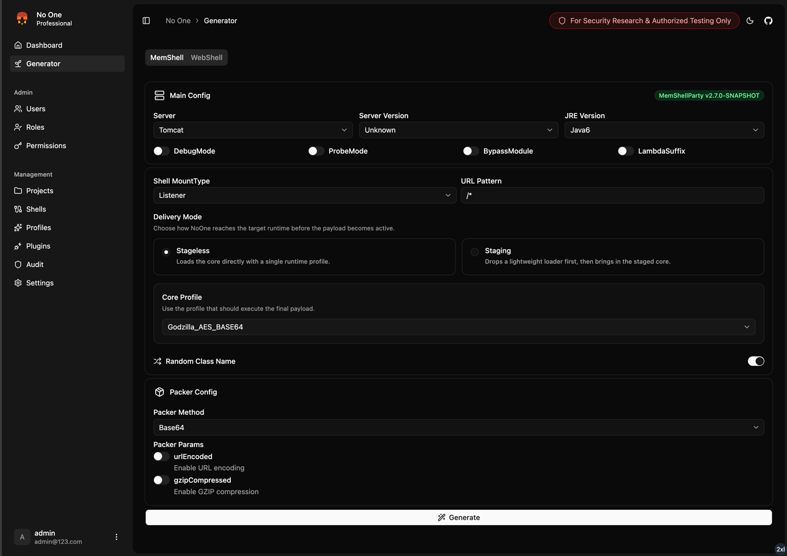
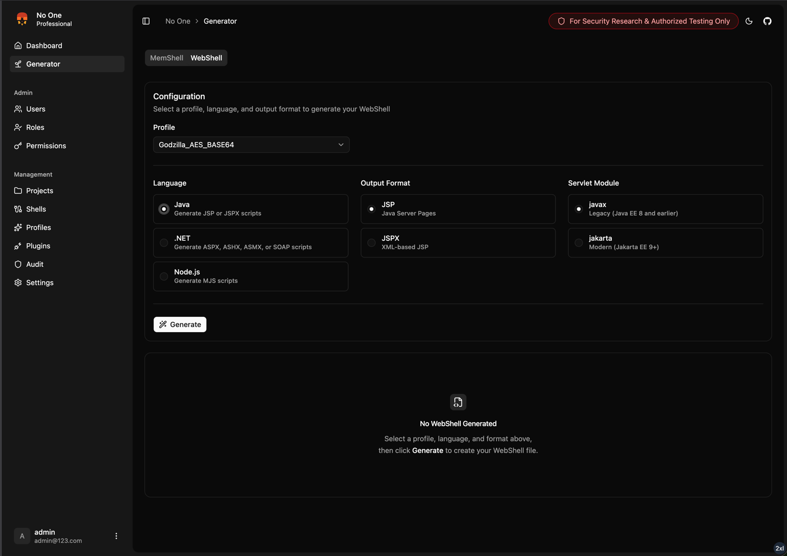
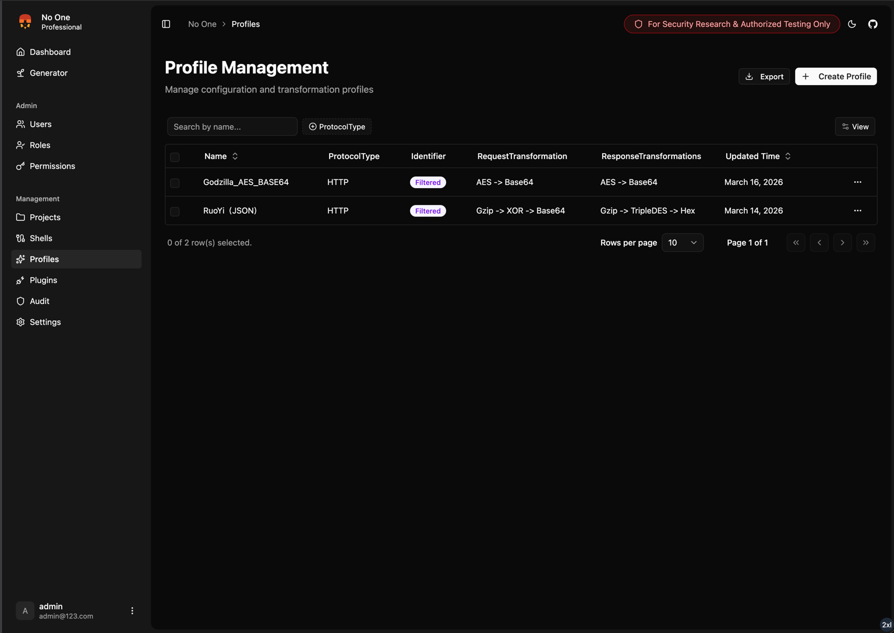
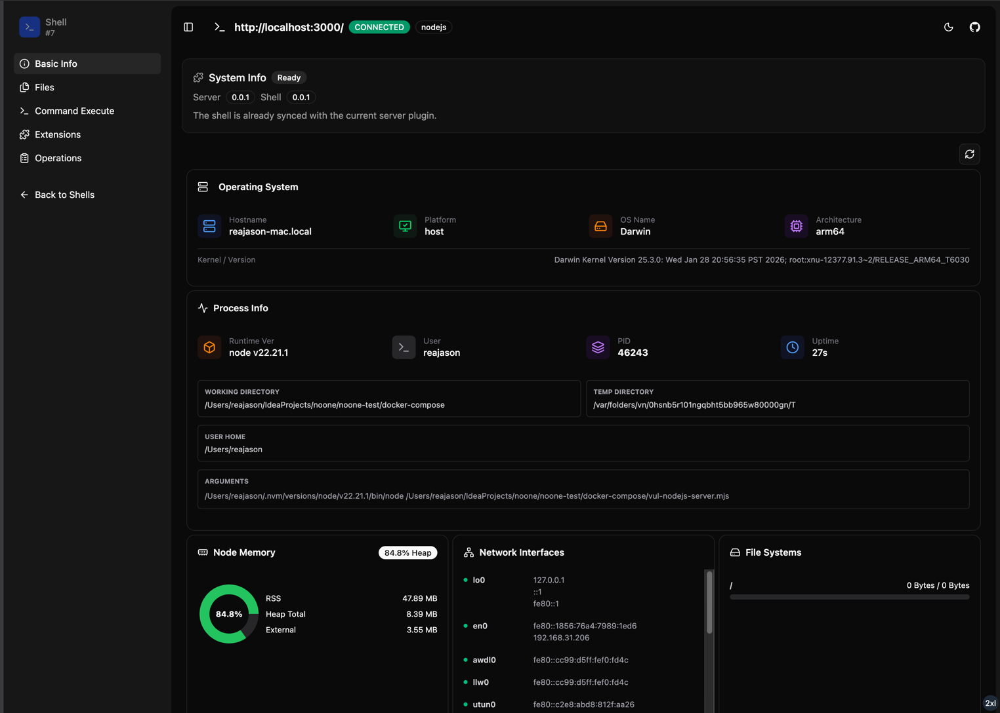
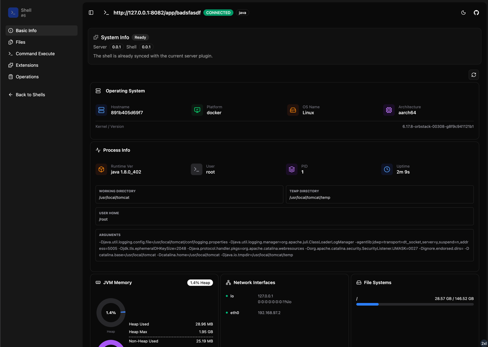
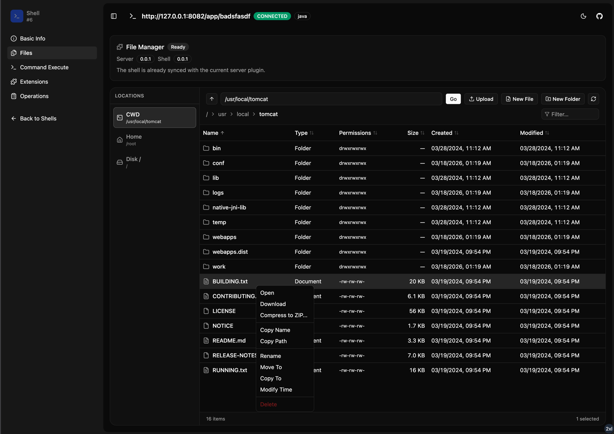
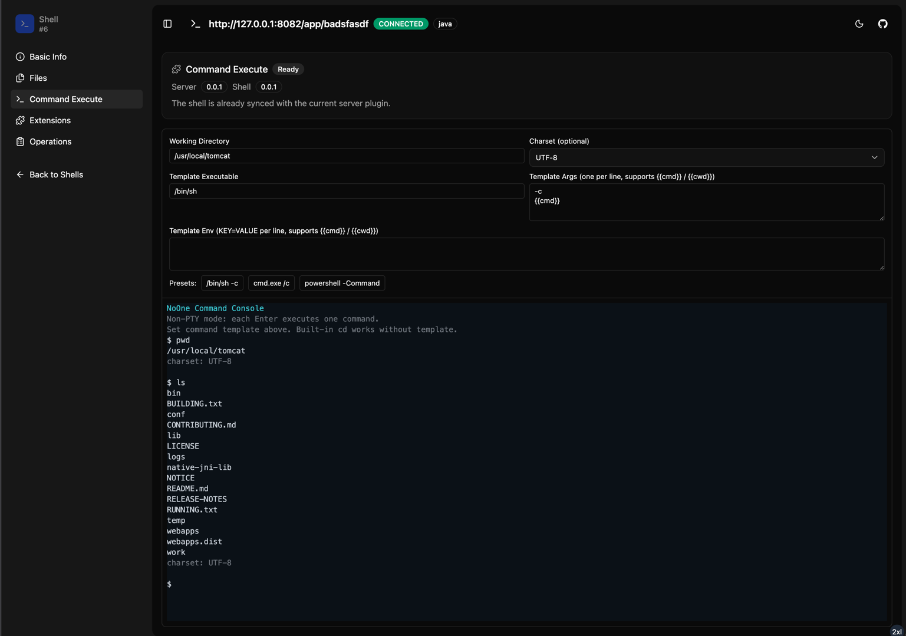

# No One

No One（无名）：Next Generation Polyglot Website Manager，打破语言边界，Java、Node.js... 让我们一起如入无人之境。

> [!WARNING]
> 本工具仅供安全研究人员、网络管理员及相关技术人员进行授权的安全测试、漏洞评估和安全审计工作使用。使用本工具进行任何未经授权的网络攻击或渗透测试等行为均属违法，使用者需自行承担相应的法律责任。

> [!TIP]
> 由于本人仅是 RASP 安全产品研发，无实战经验，此项目仅用于本人更好地了解 Web 攻防场景下常见的攻击行为，从而编写更可靠的
> RASP
> 防御规则。欢迎加入 TG 交流群，一起学习交流。

## 主要功能

- 支持 Stager/Stageless 模式，同时支持 Loader + Core 使用双 Profile 业务流量模拟
- 不仅支持 Java 站点 同时支持 Node.js + ASP.NET 站点
- 支持完善的审计、登录以及站点操作日志
- 使用 RBAC 模型，不仅支持单兵作战也支持协同作战
- 默认开启 2FA + 双 Token 刷新机制，且支持吊销 Token
- 前端使用服务端渲染，后端无需开放端口也无需使用 Nginx 反代，大幅降低攻击面
- 插件系统支持上传异步执行插件或定时任务插件，向站点发送插件包时对应的进行异步或定时任务执行
- ......

## 截图

